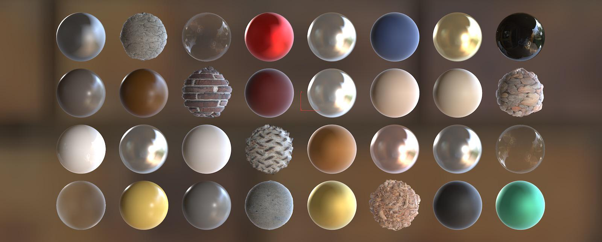

# Graphics Programming

&nbsp;
## **Shaders and Programs**

&nbsp;
If not done already, download and extract the *core* engine source files.
[Core Engine Source Files](../source/core/core.zip)

&nbsp;
Download and extract the lesson02 zipped project to same folder with *core* source files.
[Lesson02 startup project](../source/lesson02/lesson02-start.zip)

&nbsp;
Shaders are the basic building blocks of the programmable graphics pipeline. They allow programmer to determine how 3D model geometry is processed to the 2D view (the screen), and how colors of the pixels are defined. Shaders are compiled into a program, which can be set active in program to render graphics with those shaders.

### Vertex Shader
Vertex shader is responsible of processing all geometry corner points (vertices). Actually, a corner point is oversimplification of the vertex, as it may contain a lot more information about the geometry being rendered.

Typically vertex shader transforms the model to desired location and orientation, and finally applies a *perspective projection* to make the scene appear 3D.

### Fragment Shader
Fragment shader (Pixel Shader in DirectX) produces output color that is applied to framebuffer (typically the monitor screen).

### Shader Program
A vertex and fragment shader are compiled into a program that can be used for graphics rendering. Each program must have a vertex and fragment shader. Shaders, on the other hand can be used with multiple programs.

&nbsp;
----
**© 2024 Jani Immonen**

