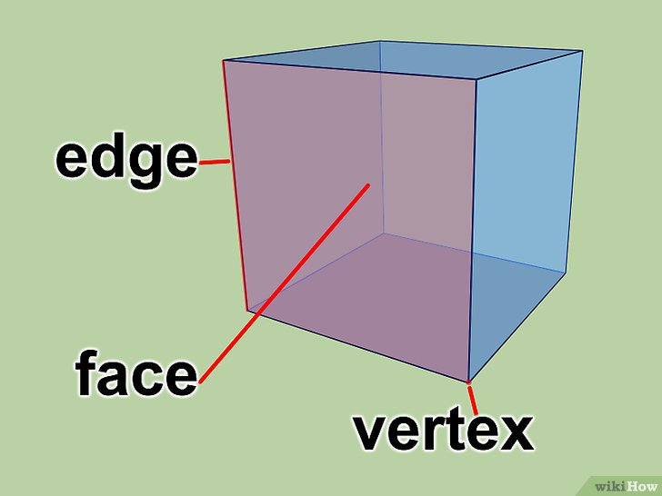

# Graphics Programming

&nbsp;
## **Vertex**

&nbsp;
[Lesson source code](../source/lesson02/)

&nbsp;
Vertex is a building block of 3D models. In its simplest form, Vertex is a corner point of a 3D model, so drawing a triangle would require 3 vertices.

But vertices are more than that. Typically they contain extra information, like:
    - information for lighting calculations
    - color information
    - reflectance
    - texture coordinates
    - weight values for animations
    - whatever programmer wants to use in shader programs

&nbsp;
----
**© 2024 Jani Immonen**

