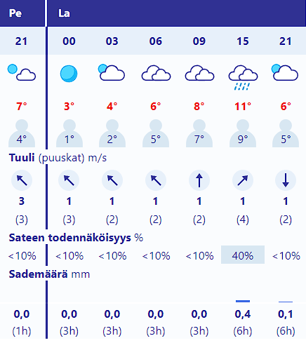

**Juuso Leppänen** 
Opiskelija

Kynnystie 1F 31B 40640 Jyväskylä

040 1234 5679

AD1885@student.jamk.fi

**Koulutus**

2. Lukio | 08/2015 - 06/2019
 
Karkun evankelinen opistossa, Ylioppilastutkinto

2. Tieto- ja viestintätekniikka insinööri | 08/2022 - 
* Jamk Tieto- ja viestintätekniikka

| Kielet    | Taito     |
| --------- | --------- |
|  Suomi    | Äidinkieli|
|  Englanti |  Sujuva   |
|  Ruotsi   |  Välttävä |

# Sää

# Opinnot

|  _Opintojakson nimi_  | _Opintojaksontunnus_ |    _Opintopisteet_   |  _Ryhmä_  | _Lukukausi_ |
| :------ | :------ | :------- | :-------- | :------ |
| [_Git -versionhallinta ja Gitlab -projektien hallintaympäristö_](https://moodle.jamk.fi/course/view.php?id=2743)       | TTZW0410-30XY   | OP 1        | TTVS3       | Syksy   |
| [_ICT-valmiudet_](https://moodle.jamk.fi/course/view.php?id=4927)        | ZZPP0420-3106   | OP 3   | TEKNS22      | Syksy  |
| [_Linuxin käyttö ja hallinta_](https://moodle.jamk.fi/course/view.php?id=6038)   |  TTC1040  | OP 5  | TTV22S3      | Syksy  |
| [_Ohjelmoinnin perusteet_](https://moodle.jamk.fi/course/view.php?id=6199)       | TTC2030-3031  | OP 5   | TTV22S3     | Syksy  |
| [_Työelämän englanti_](https://moodle.jamk.fi/course/view.php?id=5735)        | ZZPC0220-3129   |  OP 4  | TTV22S3     | Syksy  |

<figure>
    <blockquote cite="https://www.imdb.com/title/tt0088247/">
        
I'll be back

    </blockquote>
    <figcaption>—Arnold Schwarzenegger, <cite>Terminator 1984</cite></figcaption>
</figure>

[Tietokone](PC.mp4)

:sleepy:
:cry:
:angry:

# branch

# upstream ongelma
