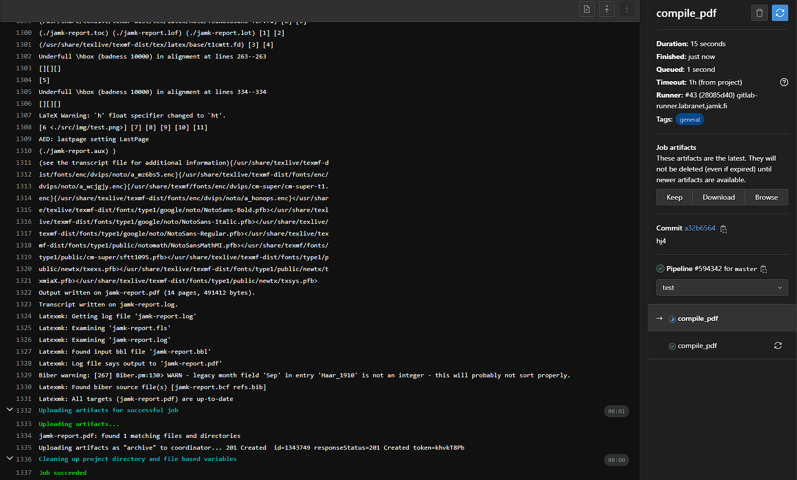

kirjauduin winSCP:n kautta jamkille ja siirsin tiedostot luomaani uuteen kansioon

vaihdoin tiedostomuotoja epäonnistuneesti, tiedostot lukukelvottomia

ongelmana oli että tiedostossa viittaukset eivät olleet käytettävissä. lisäsin viitatut tiedostot kansioon jonka jälkeen muutos onnistui ongelmitta

ongelmien selvityksen jälkeen onnistuin muuttamaan tiedostot muotoon jonka voi lukea

